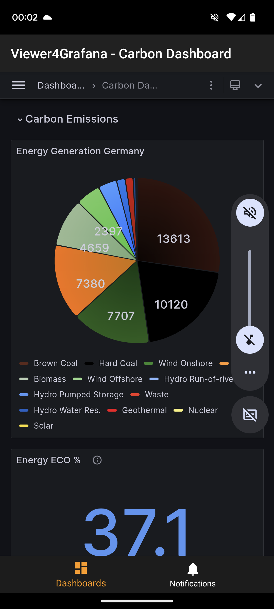

# Carbon Footprint

A Minimal Helm Chart to visualize current energy generation in Germany and the corresponding carbon footprint if you use engery NOW.

## Components

### Entsoe Data Collector

A Python Flask app origin described in [CaaS Carbon Footprint](https://github.com/caas-team/caas-carbon-footprint) which fetch data from [https://transparency.entsoe.eu/](https://transparency.entsoe.eu/).
No ServiceMonitor installed here.

### Prometheus

A plain prometheus-server without any CRD requirements, scrape only data from the Entsoe Collector.

### Grafana

Grafana installed from the origin Helm Chart. Includes the Carbon Footprint Dashboard. Beware of the non static datasource address. This must be the prometheus service endpoint. Look for `SETME: service address prometheus server`

Additionally an Ingress can configured to expose Grafana.

```yaml
grafana:
  ingress:
    annotations:
      cert-manager.io/cluster-issuer: letsencrypt
      kubernetes.io/ingress.class: traefik
      traefik.backend.loadbalancer.sticky: "true"
      traefik.frontend.passHostHeader: "true"
      traefik.ingress.kubernetes.io/frontend-entry-points: http,https
      traefik.ingress.kubernetes.io/redirect-entry-point: https
    enabled: true
    hosts:
      - carbon.example.com
    tls:
      - secretName: carbon-example-com
        hosts:
          - carbon.example.com
```

Note: Anonymous access will be allowed per default

### Mobile access

For Android install [Grafana View](https://play.google.com/store/apps/details?id=it.ksol.grafanaview), add a new profile by a given name and the Ingress address to check the carbon emmission quickly.



### Config parameters:

#### entsoe

| Parameter | Type | Default | Description |
|-----------|------|---------|-------------|
| `entsoe.enabled` | bool | `true` |  |
| `entsoe.end` | int | `0` |  |
| `entsoe.image.pullPolicy` | string | `"Always"` |  |
| `entsoe.image.repository` | string | `"mtr.devops.telekom.de/caas/entsoe"` |  |
| `entsoe.image.tag` | string | `"0.0.5"` |  |
| `entsoe.podSecurityContext.fsGroup` | int | `1000` |  |
| `entsoe.podSecurityContext.supplementalGroups[0]` | int | `1000` |  |
| `entsoe.proxy.enabled` | bool | `false` |  |
| `entsoe.resources.limits.cpu` | string | `"200m"` |  |
| `entsoe.resources.limits.memory` | string | `"256Mi"` |  |
| `entsoe.resources.requests.cpu` | string | `"100m"` |  |
| `entsoe.resources.requests.memory` | string | `"128Mi"` |  |
| `entsoe.securityContext.allowPrivilegeEscalation` | bool | `false` |  |
| `entsoe.securityContext.capabilities.drop[0]` | string | `"ALL"` |  |
| `entsoe.securityContext.privileged` | bool | `false` |  |
| `entsoe.securityContext.readOnlyRootFilesystem` | bool | `true` |  |
| `entsoe.securityContext.runAsGroup` | int | `1000` |  |
| `entsoe.securityContext.runAsUser` | int | `1000` |  |
| `entsoe.start` | int | `1` |  |

#### prometheus

| Parameter | Type | Default | Description |
|-----------|------|---------|-------------|
| `prometheus.alertmanager.enabled` | bool | `false` |  |
| `prometheus.configmapReload.prometheus.image.repository` | string | `"mtr.devops.telekom.de/kubeprometheusstack/prometheus-config-reloader"` |  |
| `prometheus.configmapReload.prometheus.image.tag` | string | `"v0.67.0"` |  |
| `prometheus.image.repository` | string | `"mtr.devops.telekom.de/kubeprometheusstack/prometheus"` |  |
| `prometheus.kube-state-metrics.enabled` | bool | `false` |  |
| `prometheus.prometheus-node-exporter.enabled` | bool | `false` |  |
| `prometheus.prometheus-pushgateway.enabled` | bool | `false` |  |
| `prometheus.releaseNamespace` | bool | `true` |  |
| `prometheus.serverFiles."prometheus.yml".scrape_configs[0].job_name` | string | `"entsoe-carbon-footprint"` |  |
| `prometheus.serverFiles."prometheus.yml".scrape_configs[0].metrics_path` | string | `"/metrics"` |  |
| `prometheus.serverFiles."prometheus.yml".scrape_configs[0].scrape_interval` | string | `"2m"` |  |
| `prometheus.serverFiles."prometheus.yml".scrape_configs[0].scrape_timeout` | string | `"30s"` |  |
| `prometheus.serverFiles."prometheus.yml".scrape_configs[0].static_configs[0].targets[0]` | string | `"entsoe-carbon-footprint:80"` |  |

#### grafana

| Parameter | Type | Default | Description |
|-----------|------|---------|-------------|
| `grafana."grafana.ini"."auth.anonymous".enabled` | bool | `true` |  |
| `grafana."grafana.ini"."auth.anonymous".org_role` | string | `"Viewer"` |  |
| `grafana."grafana.ini".analytics.check_for_updates` | bool | `false` |  |
| `grafana."grafana.ini".auth.disable_login_form` | bool | `false` |  |
| `grafana."grafana.ini".users.auto_assign_org_role` | string | `"Viewer"` |  |
| `grafana.adminPassword` | string | `"prom-operator"` |  |
| `grafana.dashboardProviders."dashboardproviders.yaml".apiVersion` | int | `1` |  |
| `grafana.dashboardProviders."dashboardproviders.yaml".providers[0].disableDeletion` | bool | `false` |  |
| `grafana.dashboardProviders."dashboardproviders.yaml".providers[0].editable` | bool | `true` |  |
| `grafana.dashboardProviders."dashboardproviders.yaml".providers[0].folder` | string | `""` |  |
| `grafana.dashboardProviders."dashboardproviders.yaml".providers[0].name` | string | `"default"` |  |
| `grafana.dashboardProviders."dashboardproviders.yaml".providers[0].options.path` | string | `"/var/lib/grafana/dashboards/default"` |  |
| `grafana.dashboardProviders."dashboardproviders.yaml".providers[0].orgId` | int | `1` |  |
| `grafana.dashboardProviders."dashboardproviders.yaml".providers[0].type` | string | `"file"` |  |
| `grafana.dashboardsConfigMaps.default` | string | `"carbon-dashboards"` |  |
| `grafana.datasources."datasources.yaml".apiVersion` | int | `1` |  |
| `grafana.datasources."datasources.yaml".datasources[0].access` | string | `"proxy"` |  |
| `grafana.datasources."datasources.yaml".datasources[0].isDefault` | bool | `true` |  |
| `grafana.datasources."datasources.yaml".datasources[0].name` | string | `"Prometheus"` |  |
| `grafana.datasources."datasources.yaml".datasources[0].type` | string | `"prometheus"` |  |
| `grafana.datasources."datasources.yaml".datasources[0].url` | string | `"http://carbon-prometheus-server"` |  |
| `grafana.image.registry` | string | `"mtr.devops.telekom.de"` |  |
| `grafana.image.repository` | string | `"kubeprometheusstack/grafana"` |  |
| `grafana.initChownData.enabled` | bool | `false` |  |
| `grafana.persistence.inMemory.enabled` | bool | `true` |  |
| `grafana.rbac.namespaced` | bool | `true` |  |
| `grafana.testFramework.enabled` | bool | `false` |  |

### Credits

Frank Kloeker f.kloeker@telekom.de

Life is for sharing. If you have an issue with the code or want to improve it, feel free to open an issue or an pull
request.

